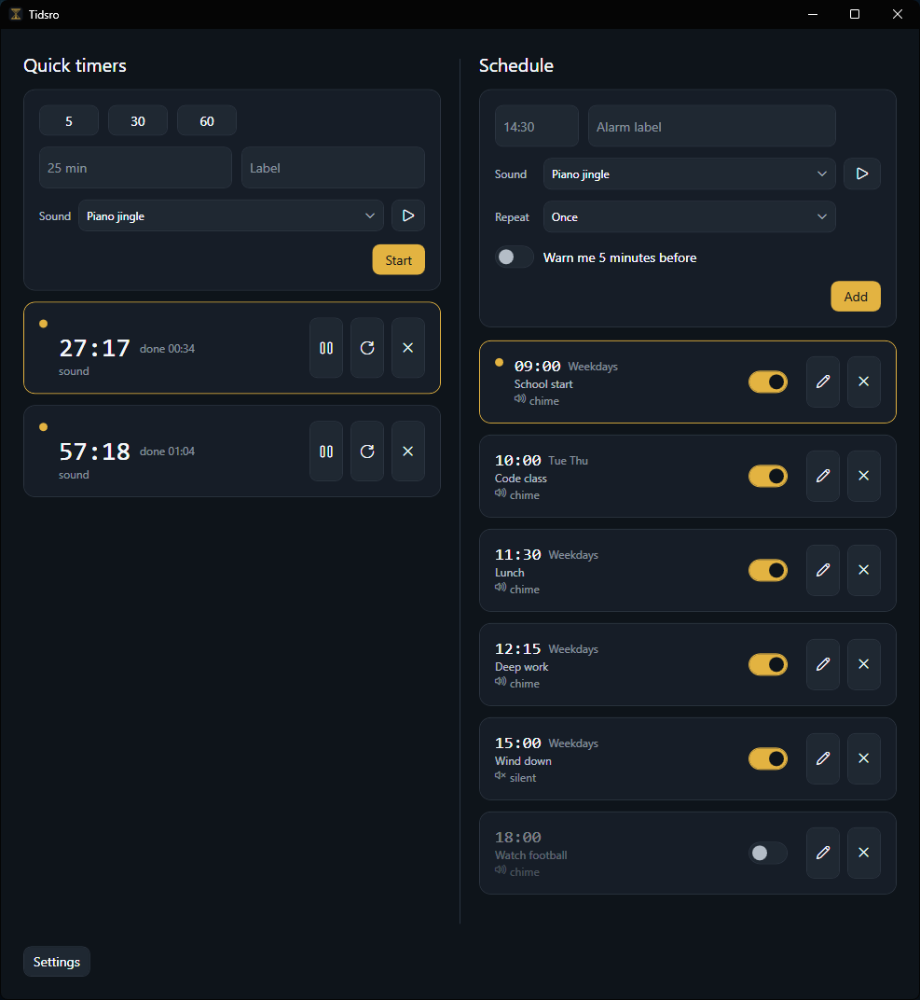
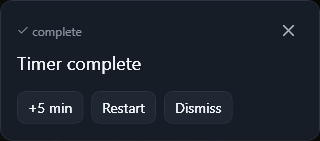
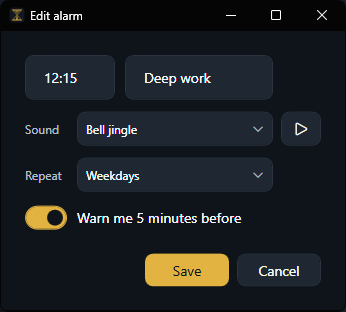

# Tidsro

A calm, dark-mode-first desktop timer for Windows — countdown timers and clock-time alarms that nudge you with a quiet corner card instead of a flashy notification.

> **Tidsro** is Norwegian: *tid* (time) + *ro* (calm / peace) — roughly *"calm time."* The name is the whole idea: a timer that's visible when you need it and invisible when you don't.

<p align="center">
  
</p>

## Who it's for

Anyone who works or studies at a computer and wants to hold their focus through the day without reaching for a phone or juggling several apps. Set your day — or your whole week — once, then forget it: Tidsro runs quietly in the background and keeps you on track, so your phone can stay on Do Not Disturb or in another room. It's built to *hold* your attention, not grab it — no flashy notifications, nothing loud unless you ask for it. Every alarm is yours to shape: silent or with a chime, one-off or repeating.

**Why I built it.** I went looking for a focus tool while studying and couldn't find one that did both timers *and* recurring alarms while staying clean and minimal — so I built the one I wish I'd had before I started school. It turns out to be just as useful in a workday as a study day.

## Status

**v1.4.0 is released** — see the [Releases page](https://github.com/malinfossum/tidsro/releases). Tidsro does **countdown timers** (presets or custom, with pause/resume, reset, an optional label, and a per-timer sound) and a **Schedule** of **clock-time and recurring alarms** — fire once at an HH:MM time, or repeat on a weekday set (Daily, Weekdays, Weekends, or custom days). Each alarm takes an optional label, a per-alarm sound, and an optional **5-minute pre-alarm warning**; the Schedule is sorted by next occurrence, alarms can be **switched off without deleting** (kept and parked at the bottom until switched back on), edited in a dialog, and deleted with an undo window, and firing survives sleep and app-relaunch within a 5-minute grace. Settings (launch-at-startup, default sound) apply on **Save**.

See the [changelog](CHANGELOG.md) for what's new in each release.

## Install

**Most people — install it:**

1. Open the [Releases page](https://github.com/malinfossum/tidsro/releases) and download **`Tidsro-Setup.exe`** from the latest release.
2. Run it. Windows may warn *"Windows protected your PC"* because the app isn't code-signed yet — click **More info → Run anyway**.
3. Click through the short wizard. Tidsro installs just for you (no admin), adds a Start Menu shortcut, and starts in the system tray.

Uninstall any time from **Settings → Apps → Installed apps → Tidsro**.

**Prefer not to install?** Download **`Tidsro.exe`** (the portable build) from the same release and double-click it — it runs as-is, no installation. The same SmartScreen note applies.

Both builds are self-contained: they run on any 64-bit Windows PC with no .NET required. Your timers and settings stay on your machine in `%AppData%\Tidsro`.

## Using Tidsro

Launching Tidsro opens its window — it remembers where you last placed it and how big it was. Closing the window tucks Tidsro back into the system tray, where it keeps running until you choose **Quit** from the tray menu; left-click the tray icon any time to reopen it. When Tidsro is started automatically with Windows, it stays quietly in the tray.

- Pick a preset (5 / 30 / 60 min) or type a custom duration: `25` (minutes), `5:00` (mm:ss), or `1:30:00` (h:mm:ss) — with an optional **label** to tell timers apart. Invalid input shows a calm inline message.
- Choose a **sound** for the next timer from the dropdown — **▶** previews it. It starts from your default sound and applies to both presets and custom timers.
- Multiple countdowns can run at once, stacked soonest-first; each shows a live mm:ss (or h:mm:ss) countdown with **pause/resume, reset** (back to the full duration), and cancel — cancelling drops a brief **Undo** bar at the bottom. Paused timers dim and drop below the active ones; resetting while paused keeps the timer stopped at the start.
- When a timer finishes, a calm card appears in the bottom-right corner. It does not steal focus.
  - **+5** arms a new 5-minute countdown. **Restart** re-runs the original duration. **Dismiss** closes the card.
  - Press **Ctrl+Alt+T** to bring the latest card into keyboard focus; Tab reaches the buttons; Enter activates; focus returns to your previous app on dismiss.
  - Multiple finished cards stack upward and dismiss independently.

<p align="center">
  <br>
  <em>A finished timer surfaces as a calm corner card — it never steals focus.</em>
</p>

The **Schedule** lives below the countdown list. Type a time — `14:30`, or shorthand like `9`, `930`, or `1430` (24-hour) — an optional label, choose a sound, set **Repeat** (Once, or a weekday set), and click **Add** (or press **Enter**). The alarm is saved immediately. Turn on **Warn me 5 minutes before** for a quiet heads-up ahead of the alarm.

- A one-shot alarm fires once; a recurring alarm repeats on its days, and the Schedule stays sorted by what's next.
- If Tidsro isn't running when an alarm time passes, it fires within a 5-minute grace window on next launch.
- Each alarm row shows its time, cadence, label, and sound. Click **Edit** (pencil) to change it in a dialog; **Save** commits, **Cancel** discards.
- **Delete** removes the alarm with a brief undo window — click **Undo** in the bar at the bottom to restore it.
- **Switch an alarm off** with the toggle on its row to keep it without it firing or warning — handy for pausing recurring alarms over a holiday — then switch it back on when you need it. Off alarms dim and drop to the bottom of the Schedule, and stay off across restarts.
- When an alarm fires, the same quiet bottom-right card appears, with **Snooze +5** (re-arms it 5 minutes later in the Schedule) and **Dismiss**.

<p align="center">
  <br>
  <em>Editing an alarm — per-alarm sound, repeat, and the optional 5-minute warning.</em>
</p>

- Open **Settings** (bottom-left of the main window) to toggle launch-at-startup and choose a default sound. Changes apply when you click **Save**; **Cancel**, **Esc**, or closing the window discards them.

## Roadmap

- Cloud sync / backup

## Stack

C# · WPF (.NET) · MVVM. Local-first: no accounts, no network — your data stays on your machine.

## Building from source

Run it directly:

```
dotnet run --project src/Tidsro
```

Build the distributable downloads into `dist/` with `publish.ps1`:

```
./publish.ps1
```

It publishes a self-contained, single-file `Tidsro.exe` (portable) and wraps it in `Tidsro-Setup.exe` (a per-user installer) with [Inno Setup](https://jrsoftware.org/isinfo.php) — install that once via `winget install --id JRSoftware.InnoSetup -e`. Attach both `.exe` files to a [GitHub Release](https://github.com/malinfossum/tidsro/releases).

## License

Apache License 2.0 — see [LICENSE](LICENSE). © 2026 Malin Fossum.
